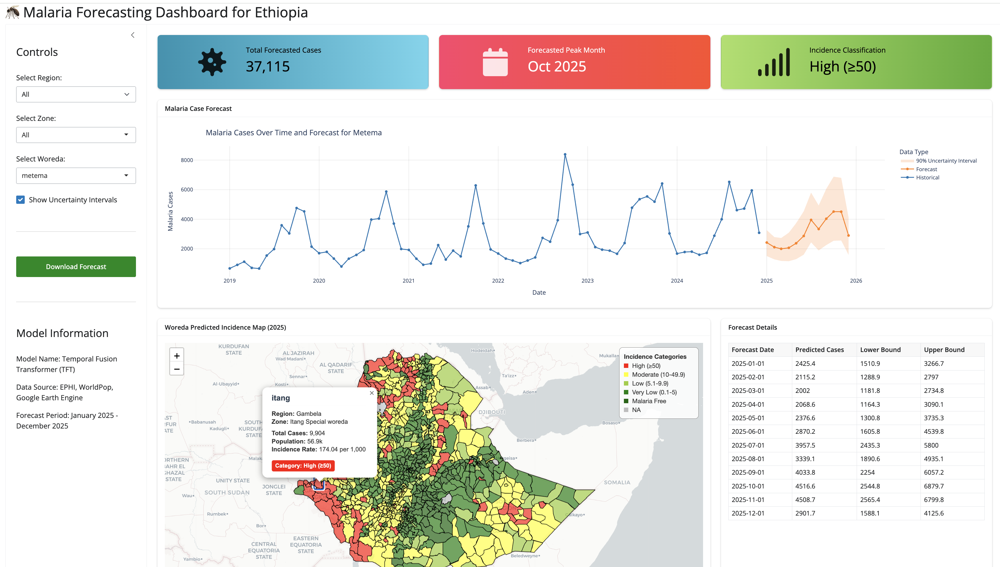
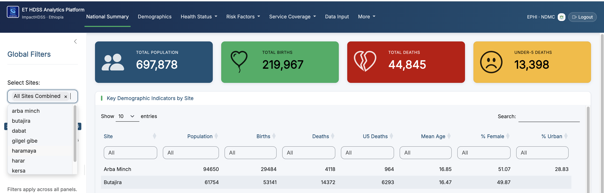
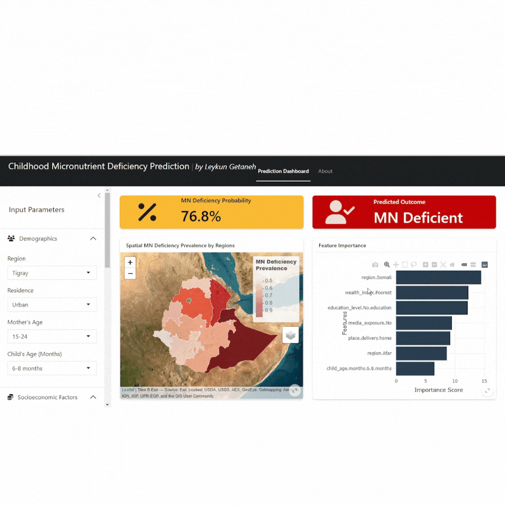
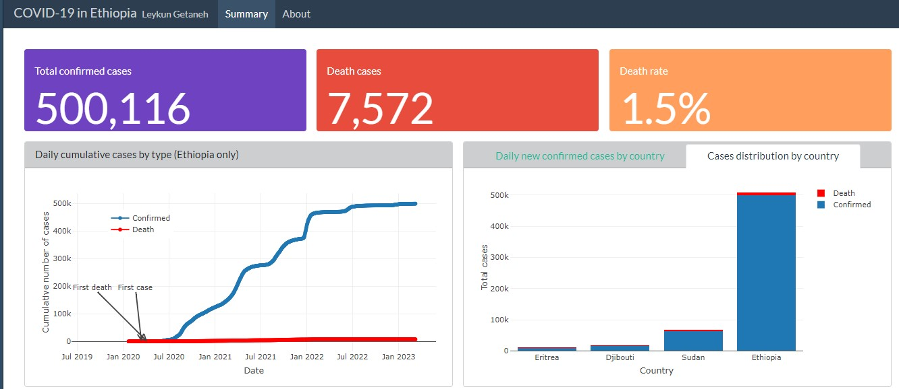

::: {.hero}
::: {.hero-inner}
::: {.hero-text}
[Available for collaboration]{.hero-badge}

# Hi, I'm [Leykun Getaneh]{.hero-grad}

::: {.hero-role}
Data Scientist · Statistician · Data Analyst
:::

::: {.hero-lead}
I bring **10+ years of experience** in research, analytics, and data science, applying **R**, **Python**, and modern **machine learning and deep learning** methods to solve challenges in **disease forecasting, predictive modeling, and public health decision-making**. My work focuses on turning complex data into actionable insights and decision-support tools.
:::

::: {.btn-row}
[View Projects](projects.qmd){.btn-primary}
<!-- [Download CV <i class="bi bi-download"></i>](img/Leykun_cv_2025_05_23.pdf){.btn-ghost target="_blank"} -->
:::

::: {.hero-social}
<a href="https://github.com/leykunget" aria-label="GitHub" target="_blank"><i class="bi bi-github"></i></a>
<a href="https://www.linkedin.com/in/leykun-getaneh-gebeye-39a17890/" aria-label="LinkedIn" target="_blank"><i class="bi bi-linkedin"></i></a>
<a href="https://x.com/likutta" aria-label="Twitter / X" target="_blank"><i class="bi bi-twitter-x"></i></a>
<a href="mailto:leyk.get@gmail.com" aria-label="Email"><i class="bi bi-envelope-fill"></i></a>
:::
:::

::: {.hero-photo}
{fig-alt="Portrait of Leykun Getaneh"}
:::
:::
:::

<!-- ───────────────────────── IMPACT / STATS ───────────────────────── -->

::: {.section .tight}
::: {.wrap}
::: {.stats}
::: {.stat}
[10+]{.stat-num}
[Years of experience]{.stat-label}
:::
::: {.stat}
[6+]{.stat-num}
[Data products deployed]{.stat-label}
:::
::: {.stat}
[5+]{.stat-num}
[Languages & tools]{.stat-label}
:::
::: {.stat}
[2]{.stat-num}
[Peer-reviewed publications]{.stat-label}
:::
:::
:::
:::

<!-- ───────────────────────── WHAT I DO ───────────────────────── -->

::: {.section}
::: {.wrap}
[What I do]{.eyebrow}

::: {.section-title}
From raw data to real-world decisions
:::

::: {.section-sub}
I combine statistical rigor with engineering to deliver analytics that public health teams can act on.
:::

::: {.cards-3}
::: {.feature}
[<i class="bi bi-graph-up-arrow"></i>]{.feature-icon}

### Modeling & Forecasting

Statistical, machine learning, and deep learning models for disease prediction and time-series forecasting — including transformer-based approaches like Temporal Fusion Transformers.

::: {.feature-tags}
[Tidymodels]{.chip} [TensorFlow]{.chip} [PyTorch]{.chip} [TFT]{.chip}
:::
:::

::: {.feature}
[<i class="bi bi-heart-pulse"></i>]{.feature-icon}

### Public Health Analytics

Analytics pipelines and decision-support systems for surveillance, early warning, and demographic health data — from woreda level to national scale.

::: {.feature-tags}
[EWARS]{.chip} [HDSS]{.chip} [Surveillance]{.chip}
:::
:::

::: {.feature}
[<i class="bi bi-bar-chart-line"></i>]{.feature-icon}

### Interactive Data Products

Dashboards, prediction apps, and automated reports that make results accessible and reproducible for non-technical stakeholders.

::: {.feature-tags}
[R Shiny]{.chip} [Streamlit]{.chip} [Quarto]{.chip} [Plotly]{.chip}
:::
:::
:::
:::
:::

<!-- ───────────────────────── FEATURED PROJECTS ───────────────────────── -->

::: {.section}
::: {.wrap}
[Selected work]{.eyebrow}

::: {.section-title}
Featured projects
:::

::: {.section-sub}
A few products spanning disease forecasting, public health analytics, HDSS, and dashboards.
:::

::: {.pgrid}

::: {.pcard}
::: {.pcard-media}
{fig-alt="Malaria Forecasting Dashboard"}
:::
::: {.pcard-body}
[Disease Forecasting]{.pcard-tag}

### Malaria Forecasting Dashboard

Interactive forecasting system for public health monitoring — real-time visualization of forecasted incidence supporting woreda, regional, and national decisions. Built with R / Python Shiny.

[Live application](https://leykunget-malaria-forecasting-dashboard.share.connect.posit.cloud/){.pcard-link target="_blank"}
:::
:::

::: {.pcard}
::: {.pcard-media .grad}
{fig-alt="hdss analytics Platform"}
:::
::: {.pcard-body}
[Public Health · HDSS]{.pcard-tag}

### impactHDSS Analytics Platform

Analytics & Visualization lead for a multi-site Health & Demographic Surveillance System — building pipelines and dashboards that turn longitudinal population data into insight.

[See in resume](resume.qmd){.pcard-link}
:::
:::

::: {.pcard}
::: {.pcard-media}
{fig-alt="Micronutrient Deficiency Prediction app"}
:::
::: {.pcard-body}
[Machine Learning]{.pcard-tag}

### Childhood Micronutrient Deficiency

ML prediction tool estimating childhood micronutrient deficiency from demographic and health features — an XGBoost model built with the Tidymodels framework.

[Live application](https://0194116f-8c9c-5c28-a013-67ea84d093e2.share.connect.posit.cloud/){.pcard-link target="_blank"}
:::
:::

::: {.pcard}
::: {.pcard-media}
{fig-alt="COVID-19 Ethiopia Dashboard"}
:::
::: {.pcard-body}
[Dashboard]{.pcard-tag}

### COVID-19 Dashboard: Ethiopia

A comprehensive view of the COVID-19 epidemic in Ethiopia — epidemiological trends, case statistics, and visualizations for evidence-based response. Built with R and Quarto.

[View dashboard](https://leykungetaneh.quarto.pub/covid-19-in-ethiopia/covid-19-et-dashboard.html){.pcard-link target="_blank"}
:::
:::

:::

::: {.btn-row}
[Browse all projects](projects.qmd){.btn-ghost}
:::
:::
:::

<!-- ───────────────────────── BACKGROUND ───────────────────────── -->

::: {.section}
::: {.wrap}
[Background]{.eyebrow}

::: {.section-title}
Experience & education
:::

::: {.twocol}

::: {.timeline-col}
#### Experience

::: {.timeline}
::: {.titem}
[Data Scientist]{.titem-role}
[National Data Management & Analytics Center (NDMC), EPHI]{.titem-org}
[Jan 2025 – Present]{.titem-date}
:::
::: {.titem}
[Lecturer · Data Scientist]{.titem-role}
[Wollo University]{.titem-org}
[Sep 2016 – Present]{.titem-date}
:::
:::
:::

::: {.education-col}
#### Education

::: {.timeline}
::: {.titem}
[MSc in Statistics]{.titem-role}
[Addis Ababa University, Ethiopia]{.titem-org}
[Sep 2010 – Jan 2013]{.titem-date}
:::
::: {.titem}
[BSc in Statistics]{.titem-role}
[University of Gondar, Ethiopia]{.titem-org}
[Sep 2006 – Jul 2008]{.titem-date}
:::
:::

#### Core stack
::: {.skill-tags}
[R]{.chip} [Python]{.chip} [SAS]{.chip} [Stata]{.chip} [SPSS]{.chip} [Git]{.chip}
:::
:::

:::

::: {.btn-row}
[View full resume](resume.qmd){.btn-primary}
[Get in touch <i class="bi bi-envelope"></i>](mailto:leyk.get@gmail.com){.btn-ghost}
:::
:::
:::
