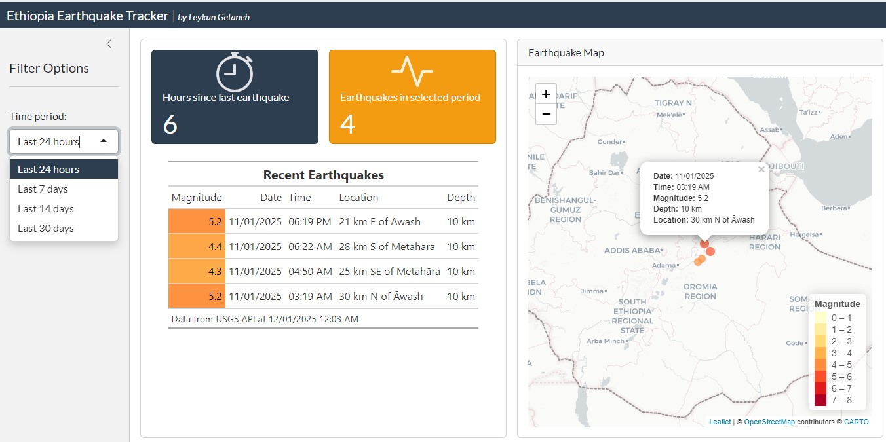
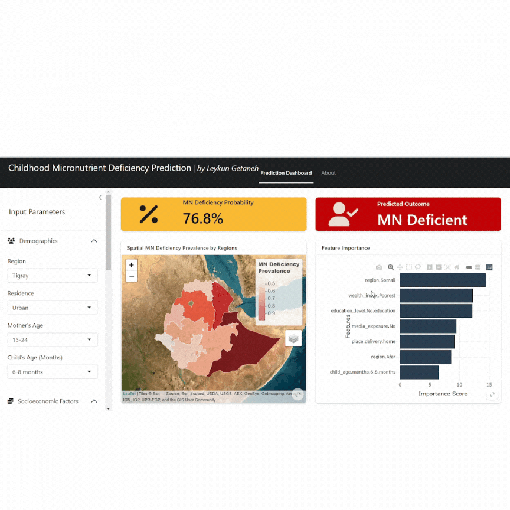
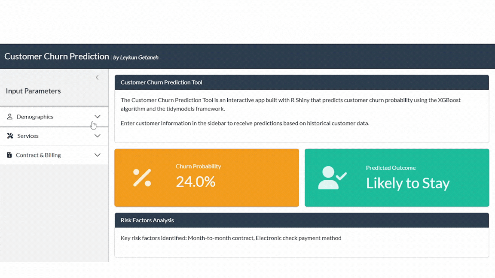
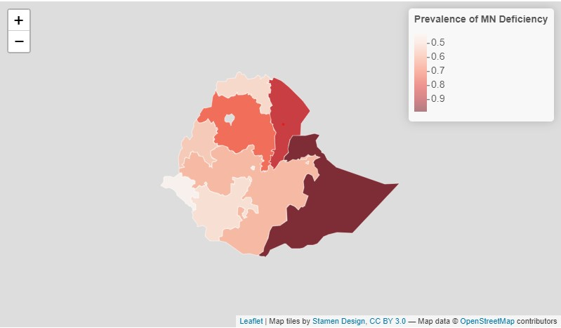
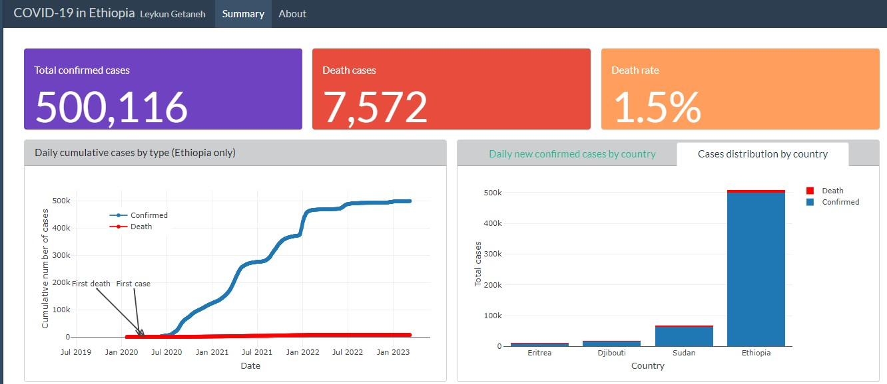

::: {.projects-intro}
Projects I have built — spanning public health dashboards, predictive tools, and geospatial analytics.
:::

::: {.project-card}
::: {.project-card-inner}
::: {.project-text}
## Malaria Forecasting Dashboard {.project-title}

An interactive malaria forecasting dashboard for public health monitoring and decision support. Built with **R Shiny / Python Shiny**, it provides real-time visualization of forecasted incidence trends and supports woreda-level, regional, and national public health decision-making.

[→ View the application](https://leykunget-malaria-forecasting-dashboard.share.connect.posit.cloud/){.project-link}
:::
::: {.project-img}
{.project-thumbnail}
:::
:::
:::

::: {.project-card}
::: {.project-card-inner}
::: {.project-img}
{.project-thumbnail}
:::
::: {.project-text}
## Ethiopia Earthquake Tracker {.project-title}

A real-time web application monitoring seismic activity across Ethiopia, built with **R Shiny**. With Ethiopia experiencing a series of earthquakes, this tool has become more essential than ever.

**Key features:** Live earthquake tracking via USGS · Interactive map visualization · Auto-refresh every 5 minutes · Magnitude range filtering

[→ View the application](https://0194598d-2226-dd34-14a9-412189b7b1dc.share.connect.posit.cloud/){.project-link}
:::
:::
:::

::: {.project-card}
::: {.project-card-inner}
::: {.project-text}
## Childhood Micronutrient Deficiency Prediction {.project-title}

An interactive prediction tool built with **R Shiny** that predicts childhood micronutrient deficiency using machine learning. The app employs an **XGBoost** model trained on demographic and health-related features, developed using the **Tidymodels** framework.

[→ View the application](https://0194116f-8c9c-5c28-a013-67ea84d093e2.share.connect.posit.cloud/){.project-link}
:::
::: {.project-img}
{.project-thumbnail}
:::
:::
:::

::: {.project-card}
::: {.project-card-inner}
::: {.project-img}
{.project-thumbnail}
:::
::: {.project-text}
## Customer Churn Prediction App {.project-title}

An interactive churn prediction tool built with **R Shiny** for the telecommunications sector. Uses the **XGBoost** algorithm integrated with the **Tidymodels** framework to analyze customer attributes and behaviors, providing insights into churn probability.

[→ View the application](https://0193b6f9-2fb2-3ecb-98eb-06390ec0cf9b.share.connect.posit.cloud/){.project-link}
:::
:::
:::

::: {.project-card}
::: {.project-card-inner}
::: {.project-text}
## Spatial Distribution of Childhood MN Deficiency {.project-title}

An interactive spatial map showing that childhood **micronutrient (MN) deficiency** in Ethiopia is most prevalent in the Somali, Afar, and Amhara regions, while Gambela, Addis Ababa, and SNNP regions have the lowest prevalence.

[→ View the publication](https://leykungetaneh.quarto.pub/spatial-distribution-of-childhood-mn-deficiency/){.project-link}
:::
::: {.project-img}
{.project-thumbnail}
:::
:::
:::

::: {.project-card}
::: {.project-card-inner}
::: {.project-img}
{.project-thumbnail}
:::
::: {.project-text}
## COVID-19 Dashboard: The Case of Ethiopia {.project-title}

A comprehensive overview of the COVID-19 epidemic in Ethiopia. Built with **R** and the **Quarto** framework, this dashboard provides epidemiological trends, case statistics, and visualizations for evidence-based public health response.

[→ View the dashboard](https://leykungetaneh.quarto.pub/covid-19-in-ethiopia/covid-19-et-dashboard.html){.project-link target="_blank"}
:::
:::
:::
