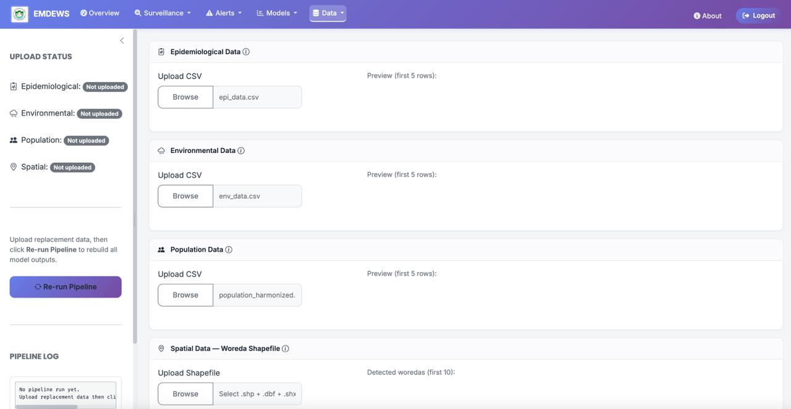
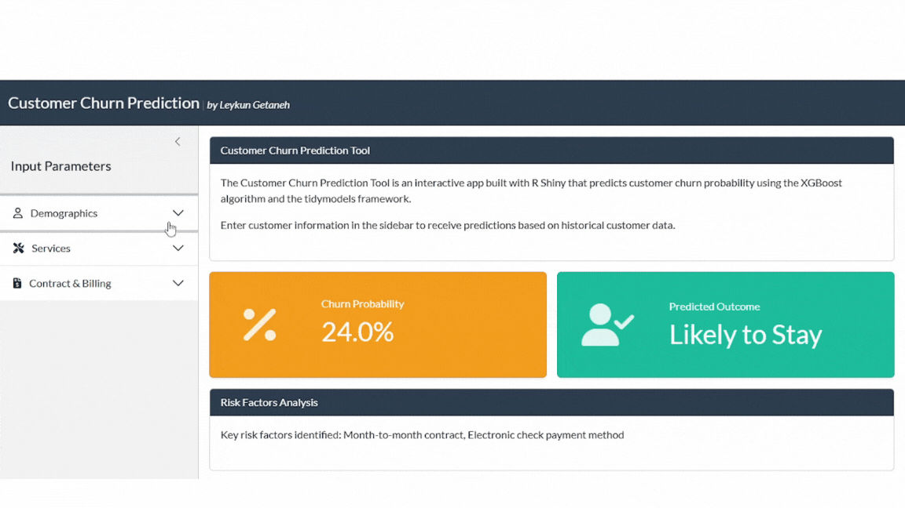
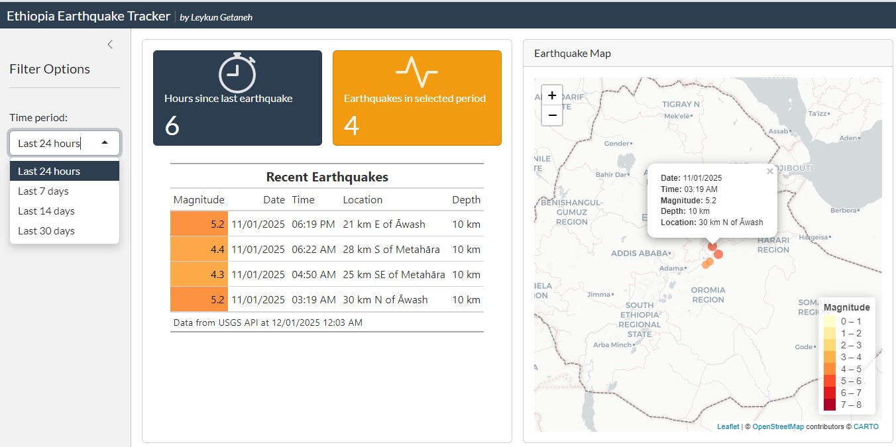
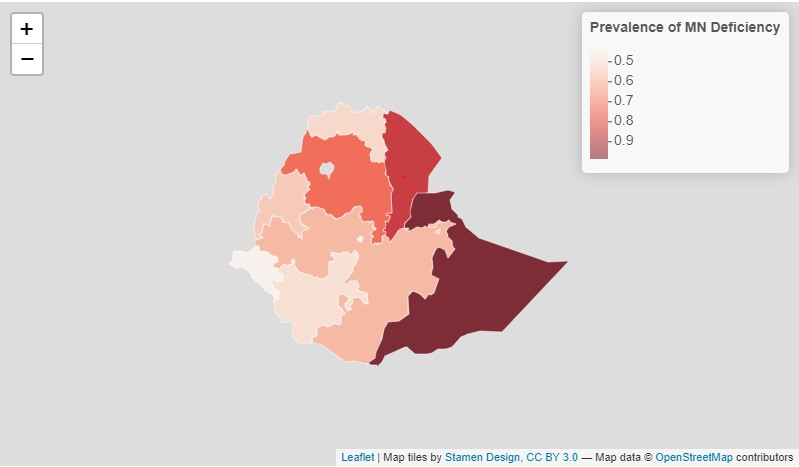

::: {.section .tight}
::: {.wrap}
[Portfolio]{.eyebrow}

::: {.section-title}
Projects
:::

::: {.section-sub}
Data products I have built — spanning disease forecasting, public health analytics, HDSS, predictive modeling, geospatial analysis, and dashboards.
:::

::: {.pgrid}

::: {.pcard}
::: {.pcard-media}
{fig-alt="Malaria Forecasting Dashboard"}
:::
::: {.pcard-body}
[Disease Forecasting · Shiny]{.pcard-tag}

### Malaria Forecasting Dashboard

An interactive malaria forecasting dashboard for public health monitoring and decision support. Built with R / Python Shiny, it provides real-time visualization of forecasted incidence trends and supports woreda-level, regional, and national decision-making.

[Live application](https://leykunget-malaria-forecasting-dashboard.share.connect.posit.cloud/){.pcard-link target="_blank"}
:::
:::

::: {.pcard}
::: {.pcard-media .grad}

{fig-alt="hdss analytics Platform"}

:::
::: {.pcard-body}
[Public Health · HDSS]{.pcard-tag}

### impactHDSS Analytics Platform

Analytics & Visualization team lead for the impactHDSS project — a multi-site Health & Demographic Surveillance System. Led development of analytics pipelines and dashboards that turn longitudinal population data into actionable insight.

[See in resume](resume.qmd){.pcard-link}
:::
:::

::: {.pcard}
::: {.pcard-media .grad}

{fig-alt="Malaria EMDEWS Dashboard"}

:::
::: {.pcard-body}
[Surveillance · Early Warning]{.pcard-tag}

### EWARS — Early Warning & Response

Lead data scientist for an Early Warning and Response System: designing outbreak-detection algorithms and integrating multi-source surveillance data to flag public health threats earlier.

[See in resume](resume.qmd){.pcard-link}
:::
:::

::: {.pcard}
::: {.pcard-media}
{fig-alt="Childhood Micronutrient Deficiency Prediction app"}
:::
::: {.pcard-body}
[Machine Learning]{.pcard-tag}

### Childhood Micronutrient Deficiency Prediction

An interactive prediction tool built with R Shiny that predicts childhood micronutrient deficiency using machine learning. Employs an XGBoost model trained on demographic and health-related features, developed with the Tidymodels framework.

[Live application](https://0194116f-8c9c-5c28-a013-67ea84d093e2.share.connect.posit.cloud/){.pcard-link target="_blank"}
:::
:::

::: {.pcard}
::: {.pcard-media}
{fig-alt="Customer Churn Prediction app"}
:::
::: {.pcard-body}
[Machine Learning]{.pcard-tag}

### Customer Churn Prediction App

An interactive churn prediction tool built with R Shiny for the telecommunications sector. Uses XGBoost with the Tidymodels framework to analyze customer attributes and behaviors, providing insight into churn probability.

[Live application](https://0193b6f9-2fb2-3ecb-98eb-06390ec0cf9b.share.connect.posit.cloud/){.pcard-link target="_blank"}
:::
:::

::: {.pcard}
::: {.pcard-media}
{fig-alt="Ethiopia Earthquake Tracker"}
:::
::: {.pcard-body}
[Geospatial · Real-time]{.pcard-tag}

### Ethiopia Earthquake Tracker

A real-time web application monitoring seismic activity across Ethiopia, built with R Shiny. Features live earthquake tracking via USGS, interactive map visualization, auto-refresh every 5 minutes, and magnitude-range filtering.

[Live application](https://0194598d-2226-dd34-14a9-412189b7b1dc.share.connect.posit.cloud/){.pcard-link target="_blank"}
:::
:::

::: {.pcard}
::: {.pcard-media}
{fig-alt="Spatial micronutrient deficiency map of Ethiopia"}
:::
::: {.pcard-body}
[Geospatial · Public Health]{.pcard-tag}

### Spatial Distribution of Childhood MN Deficiency

An interactive spatial map showing that childhood micronutrient deficiency in Ethiopia is most prevalent in the Somali, Afar, and Amhara regions, while Gambela, Addis Ababa, and SNNP have the lowest prevalence.

[View publication](https://leykungetaneh.quarto.pub/spatial-distribution-of-childhood-mn-deficiency/){.pcard-link target="_blank"}
:::
:::

::: {.pcard}
::: {.pcard-media}
{fig-alt="COVID-19 Ethiopia Dashboard"}
:::
::: {.pcard-body}
[Dashboard]{.pcard-tag}

### COVID-19 Dashboard: The Case of Ethiopia

A comprehensive overview of the COVID-19 epidemic in Ethiopia. Built with R and the Quarto framework, this dashboard provides epidemiological trends, case statistics, and visualizations for evidence-based public health response.

[View dashboard](https://leykungetaneh.quarto.pub/covid-19-in-ethiopia/covid-19-et-dashboard.html){.pcard-link target="_blank"}
:::
:::

:::
:::
:::
